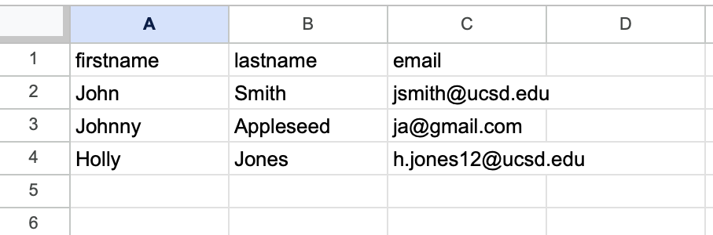

## {{page.title}}

When sending out your survey to get responses, you have two options: sending out personalized links based on a participants table or a registration form. If you have a list of participants that should fill out the survey (such as a class roster), follow **Option A**; if you do not have a list of participants that should fill out the survey and want anybody willing to fill out the survey to do so, follow **Option B**.

### Option A - Defined Participants Table

1. Get your participants table. The table needs the following three columns at the minimum: firstname, lastname, and email. It should look something like this

3. Export this file as a csv
4. Navigate the the Participants tab in Limesurvey
5. If prompted to, make the survey closed access and initialize a participants table (if these options do not pop up, do not worry)
6. Under the Participants tab, navigate to “Create”, and, under this tab, click on "Import participants from CSV file". Upload your participants csv file her and "Upload" it
7. Create tokens for each participant. Click “Generate Tokens” and hit “Create”
8. Now, edit your survey email templates. Navigate to “Email templates”
9. Edit these templates as you see fit. Make sure to edit both the “Invitation” and “Reminder” email templates
10. Once you are ready, go back to the “Participants” tab. Select all participants you want to send the survey to and click on “With Selected”. Click “Send Invitation”
11. Some people may not receive the email or may not acknowledge the email and fill out the survey. If this is the case, send a reminder email to individuals that do not fill out the survey at your discretion.

### Option B - Creating a Registration Form

Limesurvey includes a standard signup form, such as [https://limesurvey.sdsc.edu/limesurvey/index.php/638892](https://limesurvey.sdsc.edu/limesurvey/index.php/638892), in our example. We provide an option for the user to create a custom participant signup form, with a logo, title and prompts specific to the survey.

To point to this custom signup form, use the following info in the Google Sheets mappings (replace 638892 with your survey's Survey-ID):

```
SuaveFieldName: Editing#hidden
```
```
ExpressionType: template
```
```
BasedOn: image
```
```
Mapper: "<a href='https://limesurvey.sdsc.edu/signup/638892/' style='color:red;background-color: cyan;' target='_blank'>CLICK TO UPDATE YOUR ENTRY</a>".
```

For surveys with multiple responses per participant, although the link remains the same, the signup form looks a little different.

User would be directed to this page, asking for an access code that would connect them to their survey response. Alternatively, the user can also enter their email address and their access code will be sent to them. If the user has not created a response on your survey yet, they can sign up at the bottom of the page and they will be directed to the regular signup form mentioned above.

### Creating a custom signup form
1. Prepare a json file called 638892.config. The root name should be the Survey-ID in Limesurvey. The file should have the following content:

```
{
  "LandingPage": true,
  "Title": "Welcome to the USMEX Faculty Profile Update System",
  "Imagelocation": "https://limesurvey.sdsc.edu/limesurvey/upload/surveys/638892/images/USMEX_logo.jpg",
  "FirstPromptText": "If you know your access code (you should have received it when connecting to the system for the first time), please enter it here and click \"Go\" and you will be taken to your profile page.",
  "FirstPromptCaption": null,
  "SecondPromptText": "If you forgot your access code, enter your registered email address and click \"Submit\". The access code associated with your email address will  be sent to you. ",
  "SecondPromptCaption": null,
  "ThirdPromptText": "No profile? Click <a href=\"/signup/638892\">here</a> to sign up.",
  "SignupFormHeading1": null,
  "SignupFormHeading2": null
}
```
Feel free to modify the text of the title and the prompts

Once finished, download the file as a .json file. You can then edit the file type to be a .config file. **Caution**: Double check that it actually changed the file type, not just the file name. You can check this by seeing if the file name is 638892.config.json (incorrect) or 638892.config (correct).

2. Create an image file to include in the form. Recommended width is 600 px. Upload the image to Limesurvey, by selecting  Resources (a menu item on the left, under Survey menu) - Images - Upload. Make sure the file is correctly referenced under ImageLocation

3. The signup form config file (in our example, 638892.config) should be uploaded to Limesurvey under Resources - Files - Upload. Check that the file is available by opening the following page in the browser: https://limesurvey.sdsc.edu/limesurvey/upload/surveys/638892/files/638892.config  (the survey-id should correspond to your current survey.)

4. Alternatively, if you have root access, place the file onto limesurvey.sdsc.edu server, into /var/www/html/signup. Yet another option is to put the file into /var/www/html/limesurvey/upload/surveys/<survey-id>/files/ (the same directory is in item 3 above.)
